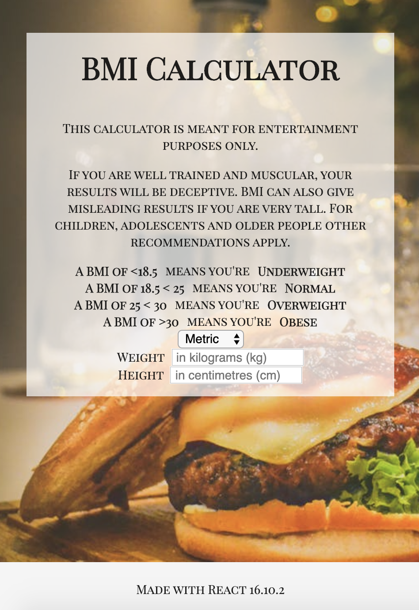

# BMI Challenge revisited
### Author  
[Clarissa Liljander](https://github.com/clalil)  
[Sverrir Steindorsson](https://github.com/shsteindorsson)
## Built with  
**Front End:** React v.16.10.2, Semantic UI, CSS  
**Back End:** N/a  
**Testing frameworks:** Cypress, Jest, Enzyme  
**Deployed at:** [Netlify](https://bmicalculator-react.netlify.com/)[](https://app.netlify.com/sites/bmicalculator-react/deploys)



## The code   
This repository contains our solution to the BMI Calculator challenge revisited in React.

## Getting started
### Dependencies  
* React   
* Enzyme
* Cypress 
* Sinon
* Yarn
* Semantic UI for React

### Setup   
To test this application you need to fork it to your own GitHub account and clone it to your local workspace.  

To install all of the dependencies:  
```
$ yarn install
```  
To run the unit tests:  
```
$ yarn test
```  
To start cypress and run the feature tests:  
```
$ yarn run cy:open
```
To start the application and run it on your local host:
```
$ yarn start
```

## Updates/Improvements  
When time given, we would love to improve the styling.

## License  
This project is under the [MIT-license](https://en.wikipedia.org/wiki/MIT_License).

### Acknowledgement  
Thank you [Craft Academy](https://craftacademy.se) for giving us this assignment.  
